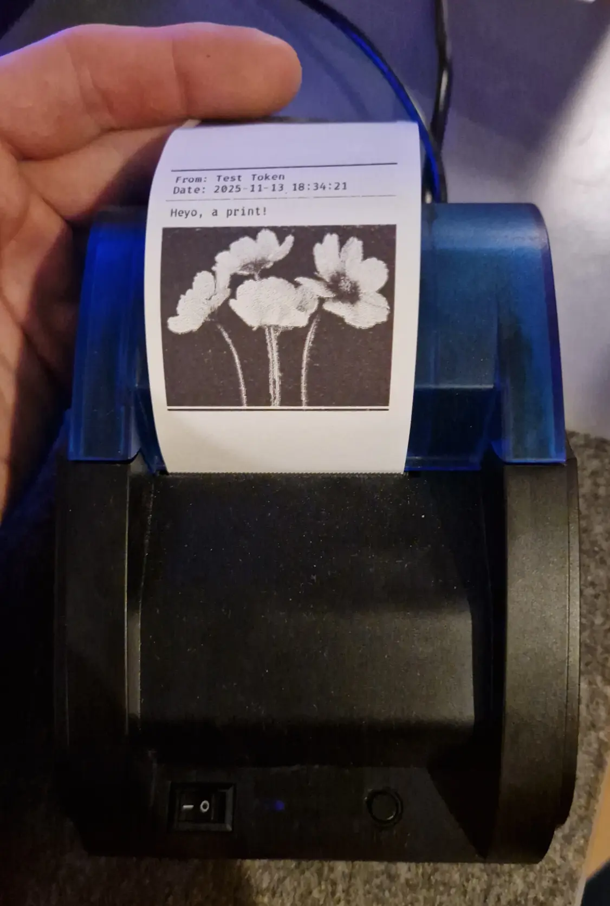
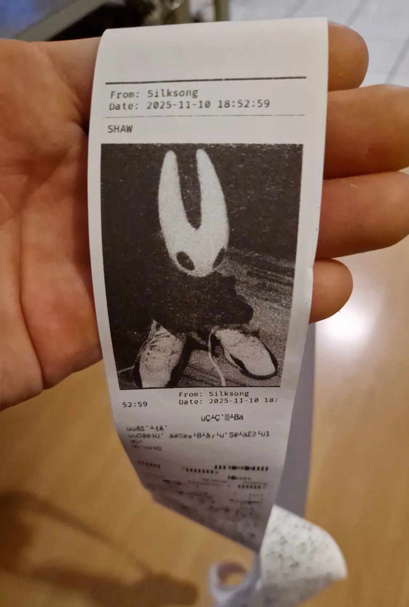
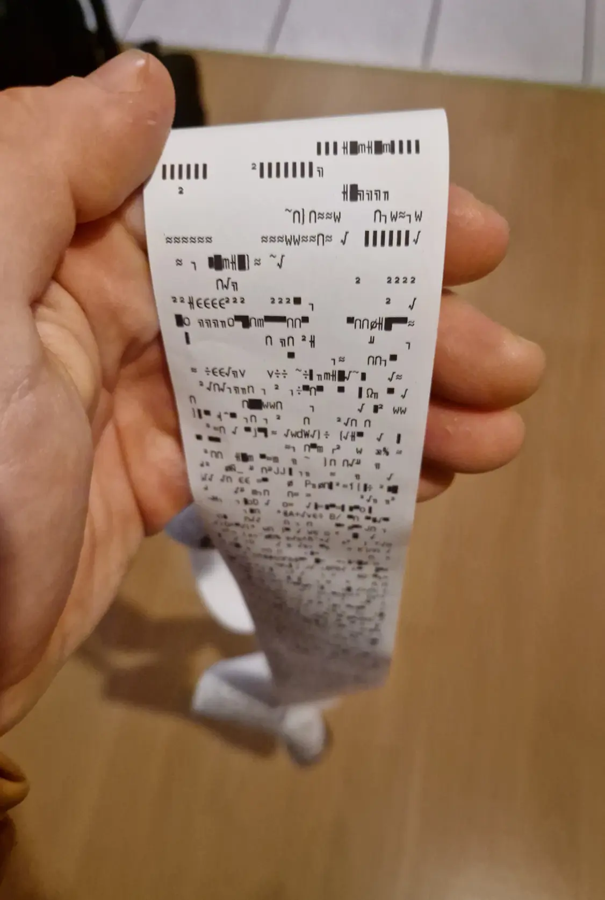

# Printomat

[Send me a message that will get printed on my home receipt printer.](https://slama.dev/printomat/) No, I'm not kidding.

| Printing images | with text | and some bugs |
|---|---|---|
|  |  |  |

## What is this?

Printomat lets you submit text and images to get printed on a receipt printer sitting at my desk.

Yes, I'm aware that FAX exists, but this is more fun.

## Why is this?

N/A

## Overview

- [`server`](server/): collects and manages incoming messages and images
  - uses [FastAPI](https://github.com/fastapi/fastapi)
  - implements IP-based timeouts so the printer doesn't die
  - supports **friendship tokens**, which can be given to users to skip time-outs
- [`client`](client/): connects to the server and prints things
  - uses websockets
  - handles the printing via [Python-ESC/POS](https://github.com/python-escpos/python-escpos)
  - prints images created via [Pillow](https://pillow.readthedocs.io/en/latest/)

To run, use

```
cp server/config.example.toml server/config.toml
uv run python -m server
```

and

```
cp client/config.example.toml client/config.toml
uv run python -m client
```
